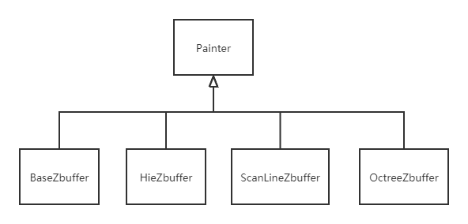
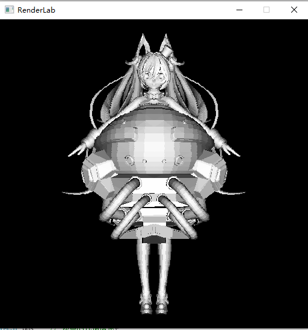

## 介绍
调用windows api实现了简单的软光栅，并在此基础上实现了四种z-buffer算法。
1. 基本z-buffer
2. 扫描线z-buffer
3. 层级z-buffer
4. 层次z-buffer + 场景八叉树

## 编程环境
* windows
* VS 2019
  
## 基本的算法介绍
###  1. 基本z-buffer
申请一个和帧缓存同样大小的深度缓存z-buffer。遍历三角网格的每一个面片，绘制像素的时候如果z值大于z-buffer中的值，则更新z-buffer并绘制。
### 2. 扫描线z-buffer
首先建立多边形表。将三角形映射到二维屏幕空间，随后根据每个三角形的最大y值将其与每一条扫描线对应。

接下来按照y值从大到小遍历扫描线，如果有对应的多边形，则将多边形的边加入动态边表。根据动态边表绘制扫描线的每一个像素。每次到下一条扫描线时，要更新动态边表中的y值和z值，如果y小于0，则删除动态边表对。

### 3. 层次z-buffer
每次绘制像素的时候更新z-buffer金字塔，绘制每一个面片的时候，首先将面片对应到相应的z-buffer层，如果深度测试失败，那么就不需要考虑这个面片。

### 4. 层次z-buffer + 场景八叉树
将网格的每一个三角面片加入八叉树，从根节点开始，将根节点剖分为八个小格子，如果面片在小格子中，那么就创建当前节点的一个子节点，并把当前节点设置为该子节点。否则将三角形面片加入该节点的三角形序列。

绘制的时候，遍历八叉树，对节点的包围盒的最大z值进行深度测试，如果失败，那么该节点中所有的三角形以及所有的子节点都不需要考虑。在包围盒深度测试后，还可以继续对三角形进行层次z-buffer测试。

## 核心结构

## 运行结果

